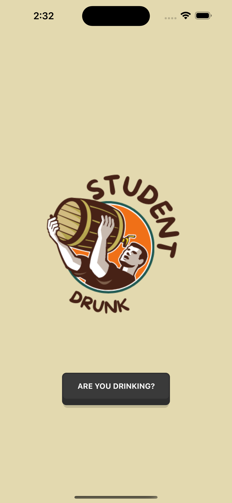
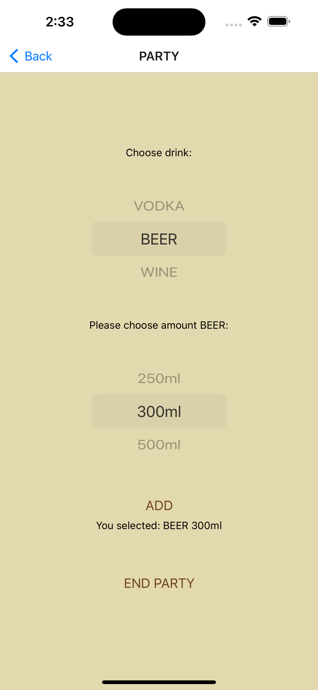
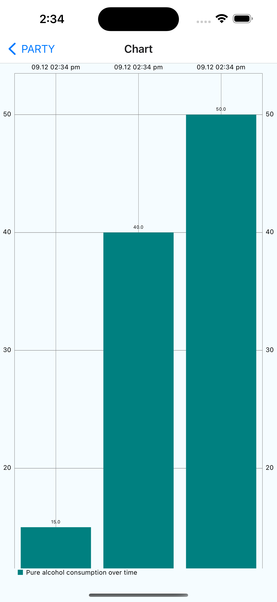

# DrunkStudent
DrunkStudent is a project about adding currently drunk beverage and displaying a graph of pure alcohol consumption over time.

## Screenshots

## License
[MIT](https://choosealicense.com/licenses/mit/)
